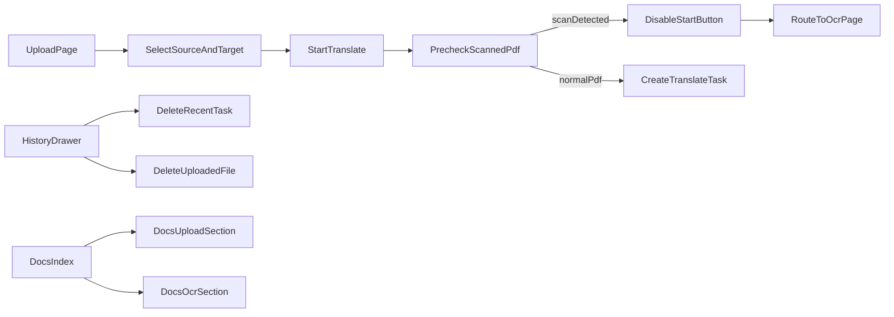

# translatepdfonline 功能修复实施计划

## 目标范围
- 完成 5 项需求：`/docs` 功能文档分区、OCR 语言适配确认与展示、upload 任务入口与历史删除修复、首页头部一行右侧对齐、translate 扫描 PDF 检测并引导 OCR。
- 语言策略按你确认：docs 一次性覆盖 10 种语言；扫描 PDF 以“零误伤优先”为前提，仅在高置信场景硬阻断（禁用开始按钮，仅引导 OCR）。

## 代码改动分组

### 1) Docs 页面补充 OCR/Upload 并按功能分区（10 语种）
- 新增文档页（每种语言对应文件）：
  - [D:/imppro/translatepdfonline/frontend/content/docs/upload.mdx](D:/imppro/translatepdfonline/frontend/content/docs/upload.mdx)
  - [D:/imppro/translatepdfonline/frontend/content/docs/ocr-workbench.mdx](D:/imppro/translatepdfonline/frontend/content/docs/ocr-workbench.mdx)
  - 以及 `*.zh.mdx/*.es.mdx/*.fr.mdx/*.it.mdx/*.el.mdx/*.ja.mdx/*.ko.mdx/*.de.mdx/*.ru.mdx`
- 调整 docs 首页总览页（10 语种）加入分区导航链接：
  - [D:/imppro/translatepdfonline/frontend/content/docs/index.mdx](D:/imppro/translatepdfonline/frontend/content/docs/index.mdx)
  - 同名多语言 `index.<locale>.mdx`
- 若侧边栏排序不稳定，补充 docs 目录元信息（按 Fumadocs 约定）以固定分组顺序。

### 2) OCR 页面语言适配
- 现有 OCR 语言链路已覆盖目标 10 语种，执行内容为“校验+补齐文案一致性”，避免显示不一致：
  - [D:/imppro/translatepdfonline/frontend/src/shared/lib/translate-langs.ts](D:/imppro/translatepdfonline/frontend/src/shared/lib/translate-langs.ts)
  - [D:/imppro/translatepdfonline/frontend/src/shared/components/translate/LanguageSelector.tsx](D:/imppro/translatepdfonline/frontend/src/shared/components/translate/LanguageSelector.tsx)
  - [D:/imppro/translatepdfonline/frontend/src/config/locale/messages/en/translate/languages.json](D:/imppro/translatepdfonline/frontend/src/config/locale/messages/en/translate/languages.json)
  - 其他 locale 的 `translate/languages.json`

### 3) Upload 页面修复任务启动与冗余按钮
- 修复“点 PDF Translate/PDF OCR 后刷新回 upload”的链路，改为在 upload 已选文件+语言后直接发起对应任务：
  - [D:/imppro/translatepdfonline/frontend/src/app/[locale]/(translate)/upload/UploadPageClient.tsx](D:/imppro/translatepdfonline/frontend/src/app/[locale]/(translate)/upload/UploadPageClient.tsx)
  - [D:/imppro/translatepdfonline/frontend/src/shared/components/translate/TranslateShellHeader.tsx](D:/imppro/translatepdfonline/frontend/src/shared/components/translate/TranslateShellHeader.tsx)
- 移除上传结果区不该出现的“Go to Translate / Go to PDF OCR”按钮渲染逻辑：
  - [D:/imppro/translatepdfonline/frontend/src/app/[locale]/(translate)/upload/UploadPageClient.tsx](D:/imppro/translatepdfonline/frontend/src/app/[locale]/(translate)/upload/UploadPageClient.tsx)
  - 视情况同步清理文案 key（`translate/home.json`）

### 4) History 抽屉统一删除能力（upload/translate/ocrtranslator/home）
- 在统一历史面板中加入“Recent tasks / Uploaded files”右上角删除动作，并对四个入口复用：
  - [D:/imppro/translatepdfonline/frontend/src/shared/components/translate/TranslateHistoryDrawerPanel.tsx](D:/imppro/translatepdfonline/frontend/src/shared/components/translate/TranslateHistoryDrawerPanel.tsx)
  - [D:/imppro/translatepdfonline/frontend/src/shared/contexts/translate-history-drawer.tsx](D:/imppro/translatepdfonline/frontend/src/shared/contexts/translate-history-drawer.tsx)
  - [D:/imppro/translatepdfonline/frontend/src/app/[locale]/(translate)/translate/TranslatePageClient.tsx](D:/imppro/translatepdfonline/frontend/src/app/[locale]/(translate)/translate/TranslatePageClient.tsx)
  - [D:/imppro/translatepdfonline/frontend/src/app/[locale]/(translate)/ocrtranslator/OcrTranslatePageClient.tsx](D:/imppro/translatepdfonline/frontend/src/app/[locale]/(translate)/ocrtranslator/OcrTranslatePageClient.tsx)
  - [D:/imppro/translatepdfonline/frontend/src/themes/default/layouts/landing.tsx](D:/imppro/translatepdfonline/frontend/src/themes/default/layouts/landing.tsx)
- 复用已有 API：`deleteTask`、`deleteDocument`，并处理当前项被删后的路由与状态清理。

### 5) 首页头部一行展示并固定右侧
- 修复 Header 桌面端换行：外层改 `nowrap`，右侧区块 `ml-auto + shrink-0` 固定靠右。
  - [D:/imppro/translatepdfonline/frontend/src/themes/default/blocks/header.tsx](D:/imppro/translatepdfonline/frontend/src/themes/default/blocks/header.tsx)
- 保证皮肤选择、语言选择、Sign In 在同一行且在右侧。

### 6) Translate 扫描 PDF 检测（防误伤优先）+ OCR 页面禁二次上传
- 检测策略改为“分级决策”，先保障不误伤：
  - `high_confidence_scan`：高置信扫描件，执行硬阻断（禁用开始按钮，仅引导 OCR）。
  - `suspected_scan`：可疑但证据不足，仅提示建议 OCR，不阻断翻译。
  - `normal_pdf`：正常放行。
- 高置信门槛采用“多信号同时满足”而非单条件命中，至少包含：
  - 文本密度接近 0（优先基于可提取文本长度/页）；
  - 图片面积占比高或图片对象密集；
  - 页均体积与页数分布符合扫描件特征；
  - 命名关键词仅作弱信号，不可单独触发阻断。
- 服务端与前端都保留可解释原因字段（`reason_codes`），用于诊断与快速回归。
- 增加安全开关与回滚能力：
  - 新增配置开关（例如 `SCAN_BLOCK_MODE=off|warn|strict`），默认先 `warn` 灰度观测；
  - 线上观测误判率达标后再切 `strict`。
- 文件：
  - [D:/imppro/translatepdfonline/frontend/src/shared/components/translate/TranslationForm.tsx](D:/imppro/translatepdfonline/frontend/src/shared/components/translate/TranslationForm.tsx)
  - [D:/imppro/translatepdfonline/frontend/src/app/api/translate/route.ts](D:/imppro/translatepdfonline/frontend/src/app/api/translate/route.ts)
- OCR 页面禁止再次上传（已有文档/任务上下文时锁定上传组件）：
  - [D:/imppro/translatepdfonline/frontend/src/shared/components/translate/UploadDropzone.tsx](D:/imppro/translatepdfonline/frontend/src/shared/components/translate/UploadDropzone.tsx)
  - [D:/imppro/translatepdfonline/frontend/src/app/[locale]/(translate)/ocrtranslator/OcrTranslatePageClient.tsx](D:/imppro/translatepdfonline/frontend/src/app/[locale]/(translate)/ocrtranslator/OcrTranslatePageClient.tsx)

## 任务流关系图

## 验收清单
- `/docs` 可见 Upload 与 OCR 分区，并在 10 语种下都有对应页面。
- upload 选定文件与语言后，点击左侧 PDF Translate/PDF OCR 直接进入任务流程，不再“刷新回 upload”。
- upload 页面不再出现“Go to Translate / Go to PDF OCR”冗余按钮。
- upload/translate/ocrtranslator/home 的 history 中，`Recent tasks` 与 `Uploaded files` 均可删除。
- 首页头部右侧控件（皮肤、语言、Sign In）桌面端始终同一行且靠右。
- translate 扫描检测满足“零误伤优先”：正常可翻译 PDF 不被阻断；仅高置信扫描件被灰禁并引导 OCR。
- 检测结果可解释（可输出原因码），并支持通过开关从 `warn` 快速回退到 `off`。
- OCR 页存在已上传文件时禁止再次上传。