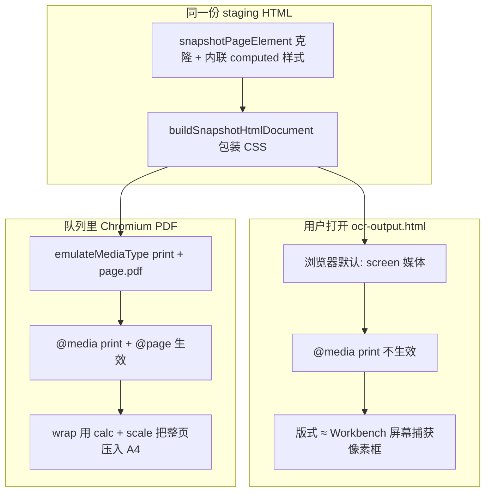

# 快照 HTML / PDF 与 Workbench 对齐（对照参考项目）

## 范围与验收（定死）

- **架构**：不改导出链路；PDF **必须**仍走 **DOM 快照**（`collectWorkbenchSnapshotHtml` → staging HTML → `renderWorkbenchHtmlToPdfBytes`），不得改为 Markdown/JSON 重排等旁路。
- **可调范围**：仅限 [`parse-result-export-snapshot.ts`](frontend/src/shared/ocr-workbench/parse-result-export-snapshot.ts) 中 **`buildSnapshotHtmlDocument` 的 CSS**，以及 [`ocr-export-pdf-cloudflare.ts`](frontend/src/shared/lib/ocr-export-pdf-cloudflare.ts) 中 **`page.pdf` / 视口 / 打印媒体**等与参考一致的参数。
- **必要条件**：交付物 PDF 在版式、块相对位置、分页语义上须与 **Workbench 当前画布**一致；Workbench 为验收基准（屏幕捕获尺寸与内容为准，A4 为纸张约束下的等比落版，与参考项目行为一致）。
- **参考源**：[`D:/imppro/onlinepdftranslator/src/shared/lib/translator`](file:///D:/imppro/onlinepdftranslator/src/shared/lib/translator) 下与快照/PDF 相关的实现（以 `parse-result-export-snapshot.ts` 的 `buildSnapshotHtmlDocument` 与 PDF 所用 HTML 的 print 语义为准）；本仓库 [`parse-result-export-html.ts`](frontend/src/shared/ocr-workbench/parse-result-export-html.ts) 中已对齐的 snapshot 样式应与之**同源**，避免双轨。

## 流程梳理（回答「怎么回事」）

- **Workbench**：[`parse-result-canvas.tsx`](frontend/src/shared/ocr-workbench/parse-result-canvas.tsx) 里 `data-export-page` 根节点用 `renderBox.w/h * scale` 定宽高；[`snapshotPageElement`](frontend/src/shared/ocr-workbench/parse-result-export-snapshot.ts) 用 `getBoundingClientRect` 得到 `pageW/pageH`，并写入每节的 `--page-w/--page-h/--print-scale`。
- **HTML 导出与 Workbench 一致**：下载的 HTML 在标签页里是 **screen**，几乎不走 `@media print`，所以你看到的是「未缩放的白页 + 灰底」的屏幕版式，和画布一致。
- **PDF 与 Workbench「看起来」不一致的根源**：PDF 路径 [`htmlToPdfBytesCloudflareWithDiagnostics`](frontend/src/shared/lib/ocr-export-pdf-cloudflare.ts) 使用 **print**；版式应由快照 CSS 里 **`@media print` + `transform: scale(--print-scale)` + `calc(var(--page-w)*...)`** 把**同一块像素内容**等比放进 **A4 `@page`**。这与参考项目的设计一致。
- **不是**「OCR 与 Source 双栏 / unified scroll」本身改坏了导出逻辑；真正的问题是 **translatepdfonline 上 `buildSnapshotHtmlDocument` + `page.pdf` 被改成与参考分叉**（去掉 A4 `@page`、去掉 print 缩放、`preferCSSPageSize: false`、base 里强行 `page-break` 等），导致 **打印页盒与内容盒不一致**（你看到的「PDF 页与白底/背景大小对不上」）。

参考对照：

- [onlinepdftranslator `parse-result-export-snapshot.ts` 中 `buildSnapshotHtmlDocument`](file:///D:/imppro/onlinepdftranslator/src/shared/lib/translator/parse-result-export-snapshot.ts)（约 462–514 行）：`viewport` 为 `device-width`、`max-width:100%`、`@page size A4`、`@media print` 下 **scale + wrap 尺寸**。
- 本仓库 [`parse-result-export-html.ts`](frontend/src/shared/ocr-workbench/parse-result-export-html.ts) 内嵌的 `.snapshot-page-wrap` / `@page` / `@media print` 与上述**一致**（约 245–300 行）；**Workbench 导出**却只走 [`parse-result-export-snapshot.ts`](frontend/src/shared/ocr-workbench/parse-result-export-snapshot.ts) 的 `buildSnapshotHtmlDocument`，因此两处必须**同源**，否则「HTML 自建文档 vs DOM 快照文档」双轨漂移。

## 建议实现（按优先级）

### 1. 恢复 `buildSnapshotHtmlDocument` 与参考一致（核心）

在 [`frontend/src/shared/ocr-workbench/parse-result-export-snapshot.ts`](frontend/src/shared/ocr-workbench/parse-result-export-snapshot.ts) 将 `buildSnapshotHtmlDocument` **恢复为与参考项目等价的结构与语义**：

- `meta viewport`：`width=device-width,initial-scale=1`（与参考一致）。
- `.snapshot-page-wrap`：`max-width:100%`；**不要**在 base 里写死全局 `page-break-after`（分页仅放在 `@media print`，与参考一致）。
- `@page { margin:0; size:A4 ${orientation}; }`，并恢复函数参数 `options.orientation` 的使用（与 [`OcrParseWorkbench`](frontend/src/shared/ocr-workbench/OcrParseWorkbench.tsx) 传入的 `portrait` 一致）。
- `@media print`：恢复 **`.snapshot-page-wrap` 的 width/height calc、`overflow:hidden`、`.snapshot-page-scale` 的 `width/height` + `transform:scale(var(--print-scale))`**（与参考及本仓库 `parse-result-export-html.ts` 一致）。

**保留** translatepdfonline 在 `snapshotPageElement` 里「解析失败仍保留 `img` URL」的行为（与参考的 `BLANK_PIXEL` 差异不动，属 R2 物料化路径，与 A4 版式无关）。

### 2. 恢复 PDF 与 `@page` 的配合

在 [`frontend/src/shared/lib/ocr-export-pdf-cloudflare.ts`](frontend/src/shared/lib/ocr-export-pdf-cloudflare.ts)：

- 将 `page.pdf` 的 **`preferCSSPageSize` 改回 `true`**，以便尊重快照里的 `@page size: A4` 与 print 布局（与参考「先按 HTML 打印语义排版再出 PDF」一致）。
- **保留**已加的 **`setViewport(4096×8192)`**：参考 HTML 使用 `max-width:100%`，Headless 默认窄视口仍会压窄布局；宽视口保证 **打印前布局计算** 与「宽屏用户 + Workbench」更接近，且不改变参考 CSS 本身。
- **保留** `emulateMediaType('print')`、`margin: 0`（与当前一致）。

### 3. 验收与可选增强

- **验收**：同一任务导出 **HTML** 与 **PDF**；在浏览器对 HTML 执行「打印预览」应接近 PDF；二者都应呈现 **A4 内等比缩放后的同一逻辑页**（与 Workbench 屏幕相比为「整体缩放」，与参考产品行为一致）。
- **可选（第二轮）**：若 PDF 内文字溢出与画布不一致，再评估把 [`parse-result-export-html.ts`](frontend/src/shared/ocr-workbench/parse-result-export-html.ts) 中的 **`workbenchLayoutFitScript`** 以「适配 `data-layout-id` 文本容器」的形式挂进 `buildSnapshotHtmlDocument`（当前脚本只查 `.pr-layout`，DOM 快照里未必命中）；这与参考的 `__prLayoutFitDone` 设计对齐。

## 明确不在此计划内

- 重写 `snapshotPageElement` 克隆算法（除非验收后发现新的结构性 bug）。
- 再引入第三套快照 CSS（应坚持 **snapshot.ts ≈ export-html.ts ≈ onlinepdftranslator** 单源语义）。
