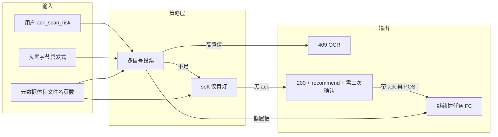

# 扫描拦截：误伤风险与「不误伤」的设计思路

## 会不会误伤？

**会。** 任何不解析整本 PDF、不跑完整 BabelDOC 检测的 Worker 侧启发式，都不可避免存在 trade-off：

| 信号类型 | 容易误伤的典型文件 |
|---------|-------------------|
| **页均体积 / 总大小**（含 `softScanRisk`） | 多页、嵌入高分辨率矢量图/照片的**正规排版 PDF**、幻灯片导出、杂志版式 |
| **头/尾字节里的 `/Image`、`(cid:`** | 压缩流内 ASCII 不可见 → **漏拦**；未压缩时 **偶发误匹配** |
| **元数据 `suspected` 一律 409（balanced）** | 所有被标为 suspected 的「像扫描」文件一律禁止直译 → **把体积启发式的假阳性直接变成用户可见的 409** |

因此：**功能越强（少进 FC）↔ 误伤越多**，单靠 Worker 静态规则无法同时做到「零漏」与「零误伤」，只能逼近。

---

## 设计原则（减少误伤同时保留能力）

1. **禁止用单一弱信号做硬拦截**  
   硬 409 至少满足 **「高置信组合」**：例如 `(元数据 suspected) AND (二进制 strong≥1)`，或 `(softScanRisk) AND (二进制任一强信号)`，而不是「suspected 即拦」。

2. **把「体积 soft」降级为「黄灯」而非「红灯」**  
   - **红灯（409）**：高置信（文件名扫描词 + 大体积，或 binary 极强，或 strict 下的原 high）。  
   - **黄灯（不默认拦）**：仅 softScanRisk → 返回 **200 + 扩展字段** `scan_recommendation: 'ocr'`，前端弹确认「仍尝试直译 / 去 OCR」；用户点「仍直译」再走 **二次请求**（带 `ack_scan_risk=1` 或短期 signed token），Worker 才放行。  
   这样误伤由用户一次点击承担，自动化路径仍偏安全。

3. **可观测 + 可调参**  
   在 [translate-scan-precheck.ts](d:/imppro/translatepdfonline/frontend/src/shared/lib/translate-scan-precheck.ts) / [route.ts](d:/imppro/translatepdfonline/frontend/src/app/api/translate/route.ts) 打结构化日志（已有 `scan_precheck_v2`），增加 **版本号与阈值快照**；用 env 暴露 `SCAN_SOFT_*` 阈值，便于线上按数据调参而不改代码。

4. **模式分层（产品默认）**  
   - `strict`：几乎不误伤，只拦 **metadata high**。  
   - `balanced`：**多信号投票**（推荐默认）。  
   - `aggressive`：宁可误伤也要少进 FC（内部/灰度）。  
   避免把「aggressive 语义」塞进默认 `balanced`。

5. **长期更准（可选、成本高）**  
   Worker 内对 **前若干 stream 做有限 Flate 解压**再数 `(cid:`/文本比；或异步队列跑轻量检测再决定是否取消任务。属于第二阶段，不在「不误伤」最小方案内必选。

---

## 推荐落地形态（与现有代码的关系）

当前实现若已改为 **「balanced + 凡 suspected 必 409」**，则与上表「原则 1」相反，**误伤风险最高**；若要保持「少误伤」，应 **收回为投票制**，并把 **softScanRisk 单独** 走黄灯或 `ack` 路径。

---

## 验证误伤率（上线前）

- 准备 **黄金集**：各 20 份「确定扫描」「确定纯文本矢量」「图文混排」「CID 重」PDF。  
- 自动化：对 `/api/translate` 只跑到 **scan 决策**（或 mock DB）断言 409/200 分布。  
- 线上：先 **只打日志不 409**（`warn` 或 feature flag），统计 `would_block` 比例再开拦。

若你希望下一步在仓库里 **把 balanced 改回投票制并加黄灯 + ack 参数**，可在确认产品交互（是否允许「仍要直译」二次确认）后单独开实现任务。
