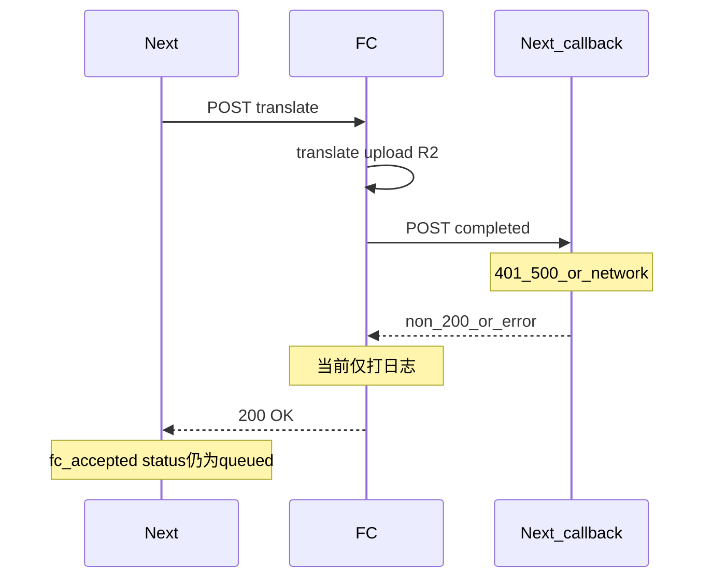

# 翻译任务长期 queued（假死）兜底方案

## 根因结论（基于代码）

1. **Next 侧** [`frontend/src/app/api/translate/invoke-fc.ts`](d:\imppro\translatepdfonline\frontend\src\app\api\translate\invoke-fc.ts)：FC 返回 `res.ok` 时只更新 `progressStage: 'fc_accepted'` 等字段，**不**把 `status` 从 `queued` 改为 `processing`；任务终态完全依赖 [`/api/translate/callback`](d:\imppro\translatepdfonline\frontend\src\app\api\translate\callback\route.ts)。

2. **FC 侧** [`babeldoc_fc/main.py`](d:\imppro\translatepdfonline\babeldoc_fc\main.py)：`translate` 在成功路径上先 `_notify_callback(..., "completed", ...)`，再 `return TranslateResponse`。而 `_notify_callback`（约 160–191 行）在回调 HTTP ≠ 200 或异常时 **仅 `logger.warning`，不抛错、不中断**，因此 **回调失败时 FC 仍返回 200** → Next 写入 `fc_accepted`，数据库仍为 `queued`，且无 cron 会再处理该状态 → 用户感知为「一直在排队 / 假死」。

3. **与「FC HTTP 一直不返回」的区别**：`invoke-fc.ts` 已对 `fetch` 使用 `AbortSignal.timeout`（默认约 10 分钟，上限受 `TRANSLATE_FC_FETCH_TIMEOUT_MS` 约束，见 [`translate-fc-contract.md`](d:\imppro\translatepdfonline\frontend\docs\translate-fc-contract.md)）。此类情况会进入 `catch` 并写 `fc_network_error_retry_scheduled`，一般不会永久卡在「无字段更新」状态。你描述的「FC 无返回」若实际已返回 200 但无终态，更符合 **回调未落地** 这一条。

## 推荐实现（小改 + 兜底）

### A. babeldoc_fc（主修复，改动面小）

**文件**：[`babeldoc_fc/main.py`](d:\imppro\translatepdfonline\babeldoc_fc\main.py)

- 将 `_notify_callback` 改为返回 **`bool`（是否收到 200）**，或返回 `(ok, last_error)` 便于记日志。
- 对 **成功完成** 的回调：在单次 `httpx` 请求外做 **有限次重试**（例如 3–5 次、间隔 1s/2s/4s），仍失败则：
  - **`raise HTTPException(422, detail=...)`**（在 `translate` 成功路径、`return TranslateResponse` 之前），**不要**再返回 200。
- 选用 **422** 的原因：Next 侧 `RETRYABLE_STATUS = {429,502,503,500}`（[`invoke-fc.ts`](d:\imppro\translatepdfonline\frontend\src\app\api\translate\invoke-fc.ts) 第 15 行），**422 不在集合内** → 走「非可重试」分支，直接把任务标为 **`failed`**，用户可重新发起翻译，避免无限「queued + fc_accepted」。
- **失败类**路径（下载失败、BabelDOC 异常等）里已有 `_notify_callback(..., "failed")`：建议同样要求「尽力送达」；若最终仍失败，可保持现有 `HTTPException` 行为或同样用 422 区分「业务失败 vs 回调投递失败」——为保持改动最小，可只对 **`completed` 回调**做强约束（这是造成「成功表象 + 无终态」的主因）。

**副作用说明（可接受的小代价）**：若翻译与 R2 上传已成功但回调始终失败，422 会让 Next 标失败，但 R2 上可能已有 `output_object_key`；同一 `task_id` 重试通常会覆盖同一 key，与「用户重试」一致。若需在文案中提示「若已扣费/已出文件请联系支持」，可在 `error_message` 中写一句即可（可选）。

### B. Next 侧兜底（双保险，逻辑独立）

**目的**：清理历史上或极端情况下已处于 **`status === 'queued'` 且 `progress_stage === 'fc_accepted'`** 且 **`updated_at` 早于阈值** 的任务，避免永久假死。

**实现方式（二选一，均为小改）**：

1. **扩展现有 Cron** [`frontend/src/app/api/translate/dispatch-pending/route.ts`](d:\imppro\translatepdfonline\frontend\src\app\api\translate\dispatch-pending\route.ts)：在调用 `dispatchPendingTranslateFcJobs` 之前或之后，执行一次 `reapStaleFcAcceptedTasks()`（新函数可放在 [`invoke-fc.ts`](d:\imppro\translatepdfonline\frontend\src\app\api\translate\invoke-fc.ts) 旁或同文件底部）。
2. **阈值**：环境变量例如 `TRANSLATE_STALE_FC_ACCEPTED_MINUTES`（默认 30–60），仅更新满足条件的行：`status='failed'`, `error_code='stale_fc_accepted'`（或类似稳定 code）, `error_message` 简短说明。

**注意**：阈值应大于「正常一次翻译 + 回调」的合理上界；`fc_accepted` 写入后 `updated_at` 在回调成功前通常不再变，因此该条件与「回调丢失」高度一致。

### C. 文档（单行补充）

在 [`frontend/docs/translate-fc-contract.md`](d:\imppro\translatepdfonline\frontend\docs\translate-fc-contract.md) 的 HTTP 与排队一节增加一句：**FC 在成功完成翻译后须确保回调 POST 返回 200，否则应对 Next 返回非 2xx（如 422），避免 Next 误判为已接受。**

## 明确不做的范围（符合你的约束）

- 不重写 BabelDOC 调用链、不把 FC 改为「先 202 再异步轮询」等大架构调整。
- 不统一整改 OCR 队列或其它业务逻辑。
- 不在此计划内强行把 `fc_accepted` 时的 `status` 改为 `processing`（会牵动前端 `taskAwaitingResult` 等语义）；以 **失败可感知 + 可重试** 为兜底目标即可。

## 验证建议

- **单元/手工**：模拟 callback URL 返回 401/500，确认 FC 在重试耗尽后对 Next 返回 422，且 DB 中任务变为 `failed`。
- **回归**：回调正常时仍为 200，`fc_accepted` → callback → `completed` 路径不变。
