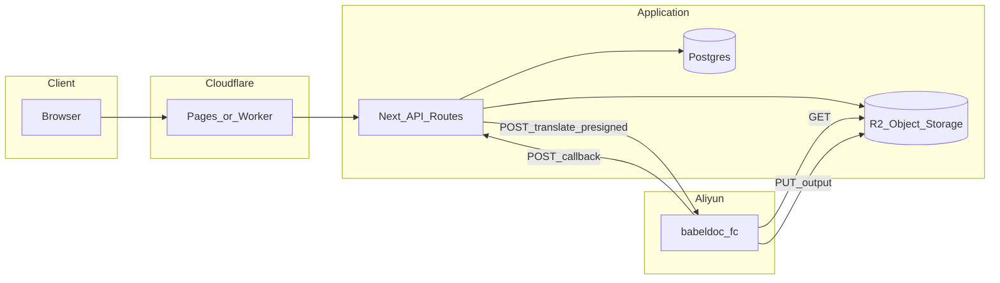

# 技术总览（精炼存档）

> 与 [PROJECT_SETUP_AND_FC.md](../frontend/docs/PROJECT_SETUP_AND_FC.md)、[translate-fc-contract.md](../frontend/docs/translate-fc-contract.md) 保持一致；细节以代码与 `frontend/docs` 为准。

---

## 1. 逻辑架构（主线：Cloudflare + FC）

- **浏览器**：营销站、翻译工作台、文档站（Next.js App Router + next-intl）。
- **Cloudflare**：托管前端与 OpenNext Worker；运行时绑定 Hyperdrive（若启用）、R2、环境变量（见 [environment-variables.md](../frontend/docs/environment-variables.md)）。
- **Next API**：创建任务、预签名上传/下载、触发 FC、接收回调、计费、Cron 调度等。
- **Postgres**：用户、任务、积分、配置等（Drizzle + migrations）。
- **R2**：源 PDF、译文 PDF、预览用对象。
- **babeldoc_fc**：无状态 HTTP 服务，拉取源 PDF、跑 BabelDOC、写回译文、回调 Next。

---

## 2. 翻译任务生命周期（概念）

1. 用户上传 → 预签名 PUT → R2 存源文件。  
2. Next 创建 `translation_tasks` 记录 → 调用 FC `POST /translate`（含 `callback_url`、`output_object_key` 等）。  
3. FC 完成后 **回调** Next（`completed` / `failed`，含页数等计费字段，见契约表）。  
4. Next 更新任务状态；用户从 **History** 或任务页预览/下载。

失败、排队、重试：`translate-fc-contract.md` 与 `fc_next_attempt_at` / dispatch Cron 相关实现。

---

## 3. 文档地图（按修改类型）

| 修改内容 | 优先阅读 |
|----------|----------|
| 环境变量、构建失败、Hyperdrive | [environment-variables.md](../frontend/docs/environment-variables.md)、[cloudflare-env-真相.md](../frontend/docs/cloudflare-env-真相.md) |
| FC 字段、回调、429/503 | [translate-fc-contract.md](../frontend/docs/translate-fc-contract.md)、[babeldoc_fc/README.md](../babeldoc_fc/README.md) |
| 支付、Webhook、产品 ID | [creem-checkout-setup.md](../frontend/docs/creem-checkout-setup.md) |
| 预览、轮询、R2 | [technical/preview-polling-translation.md](./technical/preview-polling-translation.md)、[technical/preview-r2-and-ux-updates.md](./technical/preview-r2-and-ux-updates.md) |
| 认证注册 | [technical/auth-and-registration.md](./technical/auth-and-registration.md) |
| 数据库变更 | [frontend/docs/migrations/](../frontend/docs/migrations/)、[technical/db-redis-change-workflow_6ffafc63.plan.md](./technical/db-redis-change-workflow_6ffafc63.plan.md) |

---

## 4. 全量索引

见 [ARCHIVE_INDEX.md](./ARCHIVE_INDEX.md)。
